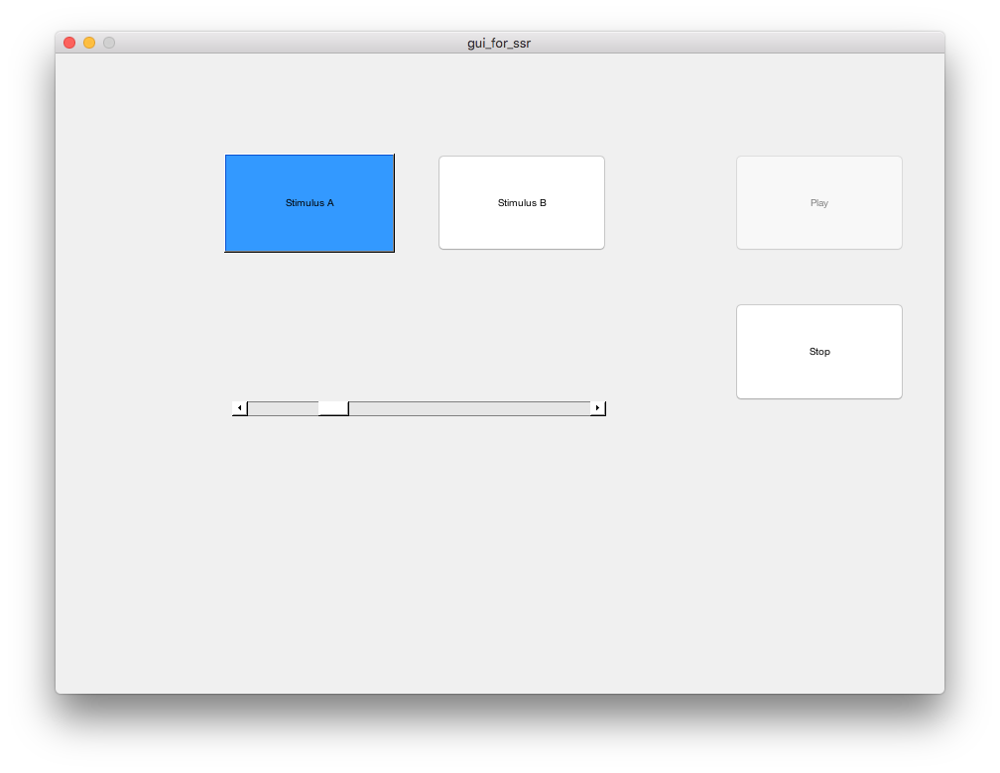

This is an example Matlab GUI for using SSR as audio backend for a listening experiment. Two stimuli are loaded into SSR, the GUI plays audio to JACK and allows for seamlessly switching between the stimuli.



To run the GUI, do the following in exactly this order:

0. Make the script ```start_ssr.sh``` executable by calling ```chmod a+x start_ssr.sh``` in a terminal
1. Start Jack at 44100 kHz sampling rate
2. Start SSR by executing ```./start_ssr.sh```
3. Start Matlab
4. Once SSR is up and running, run ```gui_for_ssr``` in Matlab

If you are on macOS, everything should be working out-of-the-box. You might have to fiddle with the lines 97-138 in ```gui_for_ssr.m``` and comment line 6 and uncomment line 9 in ```start_ssr.sh``` if you work on a different OS. (Update 2021-05-20: We have been facing issues with playing audio from MATLAB to JACK on recent macOS versions where JACK is not visible to MATLAB as an audio device. No solution yet.)

Note: You will hear audio playing when starting the GUI. This is necessary for being able to handle the audio connections in JACK.

The GUI as is requires the function ```tcpclient.m```, which is not available to everyone. If you don't have it, then get ```jtcp.m``` from [here](https://mathworks.com/matlabcentral/fileexchange/24524-jtcp-actionstr-varargin). Open ```gui_for_ssr.m``` and comment/uncomment the appropriate lines.
